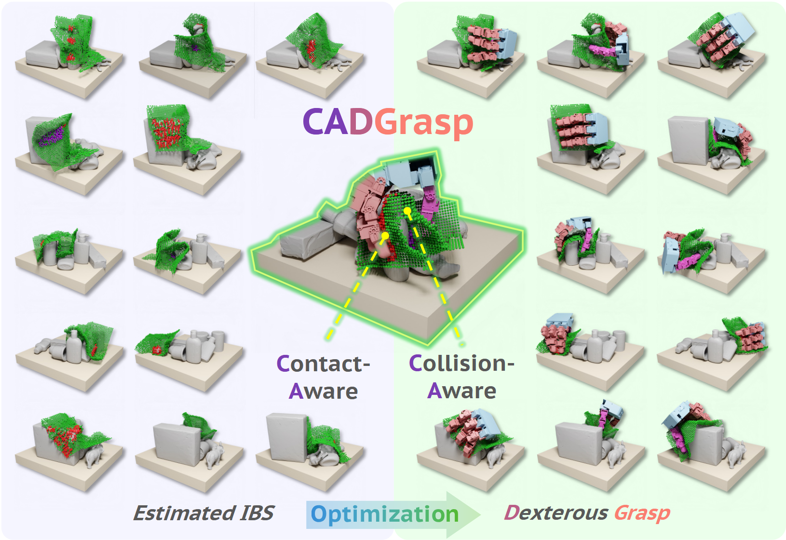

# CADGrasp: Learning Contact and Collision Aware General Dexterous Grasping in Cluttered Scenes 

Contact- and collision-aware dexterous grasping pipeline that introduces **Interaction Bisector Surface (IBS)** as an intermediate representation. We predict IBS given partial observation of cluttered scenes with a diffusion model and leverage gradient descend method to get dexterous hand grasp pose.



## Installation

### 1. Clone with submodules

```bash
git clone --recursive https://github.com/matthewmzy/CADGrasp.git
cd CADGrasp

# If you already cloned without --recursive:
git submodule update --init --recursive
```

The repository includes 4 submodules in `thirdparty/`:
- **LASDiffusion**: IBS voxel diffusion model
- **TorchSDF**: SDF computation for hand model
- **MinkowskiEngine**: Sparse convolutions (CUDA 12/13 compatible fork)
- **torchprimitivesdf**: Primitive SDF computation

### 2. Create conda environment

```bash
conda create -n cad python=3.8  # issacgym requires python<3.9
conda activate cad
```

### 3. Install PyTorch

```bash
# Install PyTorch with CUDA support (adjust for your CUDA version)
# For CUDA 12.1:
pip install torch torchvision torchaudio --index-url https://download.pytorch.org/whl/cu121
```

### 4. Install CADGrasp package

```bash
pip install -e .
```

### 5. Install PyTorch3D

```bash
# Option 1: Install via conda (recommended)
conda install pytorch3d -c pytorch3d

# Option 2: Build from source
pip install "git+https://github.com/facebookresearch/pytorch3d.git@stable"
```

### 6. Install TorchSDF (for SDF computation)

TorchSDF requires CUDA compilation. Make sure `CUDA_HOME` is set correctly:

```bash
cd thirdparty/TorchSDF
export CUDA_HOME=/usr/local/cuda  # Adjust to your CUDA path
pip install -e . --no-build-isolation
cd ../..
```

### 7. Install torchprimitivesdf

```bash
cd thirdparty/torchprimitivesdf
pip install -e .
cd ../..
```

### 8. Install MinkowskiEngine (for sparse convolutions)

For **CUDA 12.x** compatibility, we use a patched fork:

```bash
cd thirdparty/MinkowskiEngine
mkdir -p MinkowskiEngineBackend  # Required directory
export CUDA_HOME=/usr/local/cuda  # Adjust to your CUDA path
pip install . --no-build-isolation  # Do not add -e because Backend will fail to compile
cd ../..
```

> **Note**: The MinkowskiEngine submodule points to [MinkowskiEngineCuda13](https://github.com/AzharSindhi/MinkowskiEngineCuda13), which includes fixes for CUDA 12/13 compatibility.

### 9. Install IsaacGym (optional, for simulation)

Download IsaacGym from [NVIDIA](https://developer.nvidia.com/isaac-gym) and install:

```bash
cd isaacgym/python && pip install -e .
```

### Troubleshooting

**TorchSDF/MinkowskiEngine compilation fails:**
- Ensure `CUDA_HOME` points to your CUDA installation (e.g., `/usr/local/cuda-12.4`)
- Use `--no-build-isolation` flag to use existing PyTorch
- Check that `nvcc --version` matches your PyTorch CUDA version

---

## Quick Start

### Complete Pipeline

```
Download Data → Prepare Checkpoints → Data Processing → Train LASDiffusion → Predict → Evaluate → Print Results
```

### Step 1: Download DexGraspNet 2.0 Data

```bash
# Download from HuggingFace
huggingface-cli download lhrlhr/DexGraspNet2.0 --local-dir data/DexGraspNet2.0
```

### Step 2: Prepare Checkpoint Directory

Create a separate checkpoint directory for CADGrasp predictions:

```bash
# Copy the OURS checkpoint to CAD directory
cp -r data/DexGraspNet2.0/DexGraspNet2.0-ckpts/OURS data/DexGraspNet2.0/DexGraspNet2.0-ckpts/CAD
```

### Step 3: Data Processing

#### 3.1 Generate Network Input Data

Preprocess depth images to point clouds for network training:

```bash
# GraspNet scenes (100-190 dense, 200-380 loose, 9000-9900 random)
python -m cadgrasp.baseline.preprocess.compute_network_input_all \
    --dataset graspnet --scene_id_start 100 --scene_id_end 190

python -m cadgrasp.baseline.preprocess.compute_network_input_all \
    --dataset graspnet --scene_id_start 200 --scene_id_end 380

python -m cadgrasp.baseline.preprocess.compute_network_input_all \
    --dataset graspnet --scene_id_start 9000 --scene_id_end 9900

# ACRONYM scenes
python -m cadgrasp.baseline.preprocess.compute_network_input_all --dataset acronym
```

#### 3.2 Generate IBS Training Data

Three commands to generate IBS data from grasp annotations:

```bash
# 1. Simulation filtering - Filter successful grasps using IsaacGym (optional)
python src/cadgrasp/ibs/scripts/batch_filter_grasps.py \
    --scene_start 0 --scene_end 100 --gpu_ids 0,1,2,3

# 2. FPS sampling - Downsample grasps per scene (skip step 1 = assume all successful)
python src/cadgrasp/ibs/scripts/batch_fps_sample_grasps.py \
    --scene_start 0 --scene_end 100

# 3. IBS computation - Generate IBS voxel data to data/ibsdata/
python src/cadgrasp/ibs/scripts/batch_calculate_ibs.py \
    --scene_start 0 --scene_end 100
```

> See [src/cadgrasp/ibs/scripts/README.md](src/cadgrasp/ibs/scripts/README.md) for detailed parameters.

### Step 4: Train LASDiffusion

```bash
cd thirdparty/LASDiffusion
python train.py \
    --name LEAP_dif \
    --ibs_path ../../data/ibsdata \
    --scene_pc_path ../../data/DexGraspNet2.0/scenes \
    --batch_size 64 \
    --training_epoch 200000
cd ../..
```

Model checkpoints will be saved to `thirdparty/LASDiffusion/results/LEAP_dif/`.

### Step 5: Run Prediction

```bash
# Predict on all test scenes (GraspNet + ACRONYM)
python src/cadgrasp/baseline/eval/predict_dexterous_all_cates.py \
    --ckpt data/DexGraspNet2.0/DexGraspNet2.0-ckpts/CAD/ckpt/ckpt_50000.pth
```

This runs prediction on:
- GraspNet dense (100-190), loose (200-380), random (9000-9900)
- ACRONYM dataset

Results saved to `data/DexGraspNet2.0/DexGraspNet2.0-ckpts/CAD/results/`.

### Step 6: Run Evaluation

```bash
# Evaluate all splits on all datasets
python src/cadgrasp/baseline/eval/evaluate_dexterous_all_cates.py
```

### Step 7: Print Results

```bash
python src/cadgrasp/baseline/eval/print_dexterous_results.py \
    --ckpt_path data/DexGraspNet2.0/DexGraspNet2.0-ckpts/CAD/ckpt/ckpt_50000.pth
```

---

## Project Structure

```
CADGrasp/
├── src/cadgrasp/              # Main Python package
│   ├── baseline/              # DexGraspNet 2.0 baseline models
│   │   ├── network/           # Neural network architectures
│   │   ├── eval/              # Prediction and evaluation scripts
│   │   ├── preprocess/        # Data preprocessing (depth → point cloud)
│   │   └── utils/             # Utilities (robot model, simulator, etc.)
│   ├── ibs/                   # IBS data processing
│   │   ├── scripts/           # IBS computation scripts
│   │   └── utils/             # IBS utilities
│   ├── optimizer/             # Pose optimization with IBS
│   └── evaluator/             # End-to-end evaluation pipeline
├── thirdparty/                # Git submodules
│   ├── LASDiffusion/          # IBS voxel diffusion model
│   ├── TorchSDF/              # SDF computation
│   ├── MinkowskiEngine/       # Sparse convolutions (CUDA 12/13 fork)
│   └── torchprimitivesdf/     # Primitive SDF computation
├── robot_models/              # Robot URDF and mesh files
│   ├── urdf/                  # URDF files
│   ├── meshes/                # Collision and visual meshes
│   └── meta/                  # Metadata (joint limits, keypoints, etc.)
├── configs/                   # Hydra/YAML configuration files
├── tests/                     # Visualization and testing scripts
│   ├── hand_info/             # Hand model visualization and editing tools
│   └── *.py                   # Various visualization scripts
├── data/                      # Datasets (download separately)
│   ├── DexGraspNet2.0/        # Downloaded dataset
│   └── ibsdata/               # Generated IBS data
└── pyproject.toml             # Package configuration
```

---


### Hand Model Tools (tests/hand_info/)

Interactive tools for editing LEAP Hand self-collision keypoints and palmar surface points. See [tests/hand_info/README.md](tests/hand_info/README.md) for details.

| Script | Description |
|--------|-------------|
| `visualize_keypoints_gui.py` | GUI editor for penetration keypoints |
| `palmar_surface_collector.py` | Lasso selection tool for palmar surface points |
| `visualize_keypoints_plotly.py` | Browser-based 3D visualization |

---

## Module Reference

### cadgrasp.baseline
DexGraspNet 2.0 baseline implementation with graspness prediction and grasp generation.

### cadgrasp.ibs
IBS (Interaction Bisector Surface) computation from grasp data.

### cadgrasp.optimizer
Adam-based pose optimization using IBS energy functions.

### cadgrasp.evaluator
End-to-end evaluation combining LASDiffusion prediction and pose optimization.

### thirdparty.LASDiffusion
3D voxel diffusion model for IBS prediction from scene point clouds.

---

## Citation

```bibtex
@article{cadgrasp2024,
  title={CADGrasp: Contact and Collision Aware Dexterous Grasping with Interaction Bisector Surface},
  author={...},
  year={2024}
}
```

## License

MIT License
